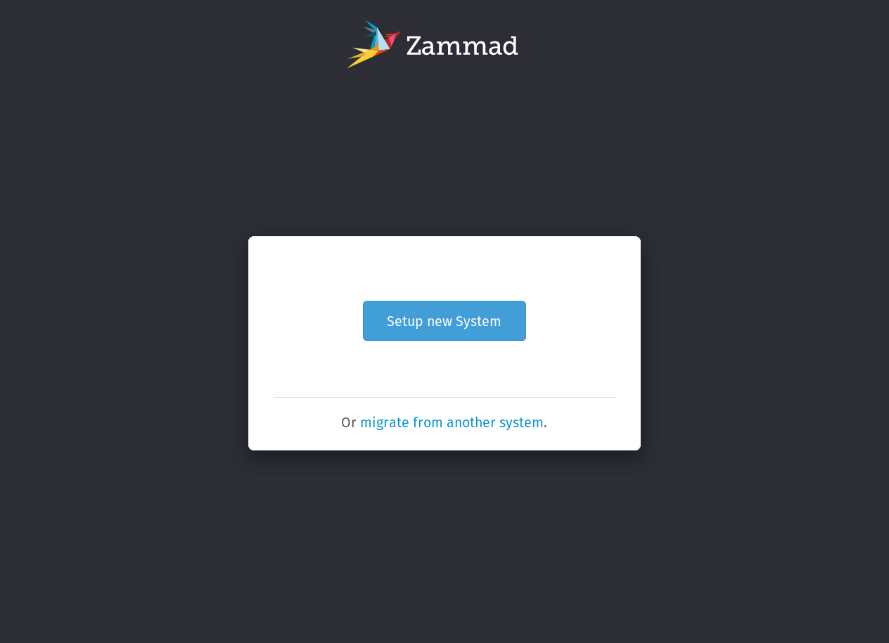
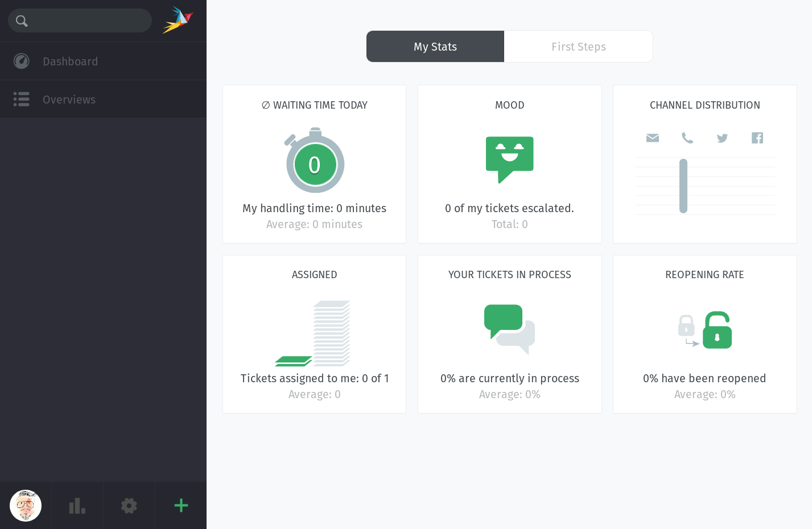

# Getting Started

## Development Environment

Please make sure that you setup your system correctly by following our "[**How to set up a development environment**](development_environment/index.md)" guide.

We emphasize to set following environment variables for developing Zammad.

* Out of the box, `rails db:seed` is _very_ slow, because it pulls a large library of user interface translations (in over thirty different languages) from a remote server.

  To speed this up, use `$Z_LOCALES` to limit the set of downloaded translations.

  ```sh
  Z_LOCALES=en-us:de-de
  ```

  **Note:** Make sure to include your locale in `$Z_LOCALES`.


## Cloning Repository

It's possible to clone the repository via HTTPS and SSH.

```sh
# HTTPS
$ git clone https://github.com/zammad/zammad.git

# SSH
$ git clone git@github.com:zammad/zammad.git
```

## Initializing Zammad

After the installation of the correct Ruby version (see [**here**](../development_environment/index.md#rvm)), the following command can be used to install all Ruby dependencies:

```sh
$ bundle config set --local without 'mysql'
$ bundle install
```

We at Zammad like to work in an efficient way, therefore we have some `Rake` tasks to speed up setting up/refreshing a Zammad installation:

```sh
$ rails zammad:bootstrap:init   # on a fresh install
$ rails zammad:bootstrap:reset  # on an existing install
```

The following sections describe in detail the steps automated by the rake tasks above. If you’re not too concerned about what’s going on under the hood,
skip ahead to [**Launching Zammad**](#launching-zammad).

### `database.yml`

The official repository does not include a `config/database.yml` file, because the contents of this file may vary from one developer to another, _e.g.,_ for different login credentials or different DB backends. Therefore we decided to exclude it from the repo to reduce the risk of someone accidentally committing such changes.

However, a working sample is provided in the `config/database` directory:

```sh
$ cp config/database/database.yml config/database.yml
```

### (Bypassing) The setup wizard

Zammad requires some extra initialization beyond the standard `rails db:` rake tasks (`create` / `migrate` / `seed`). If you visit the homepage after running those tasks and starting the server, you will be presented with a setup wizard like the one below:



The wizard can be time-consuming to go through (for instance, you have the option to enter and validate SMTP credentials for outgoing emails), but you can’t access the main dashboard (below) or interact with the rest of the app until you complete it.



You should click through the wizard just once, just to get a sense of what our users go through — but if we had to do this _every time_ we reset the database, we’d never get any actual work done. So, Zammad includes a feature called the **auto-wizard** to load the application with a set of predefined values instead.

The auto-wizard can either be run from the Rails console or triggered by a page visit in the browser, but either way, it needs two things to work:

1. a clean, freshly-seeded database, and
2. an `auto_wizard.json` config file (like the one stored in `/contrib`)
   located in the project root. Once the auto-wizard is complete, this file
   will be removed automatically.

#### Option 1: Rake task

```sh
$ rake zammad:setup:auto_wizard
```

#### Option 2: Running via `rails console`

```sh
$ cp contrib/auto_wizard_test.json auto_wizard.json
$ rails console
Loading development environment (Rails 5.1.5)
>> AutoWizard.setup
=> #<User:0x000056220b14db50...
>> UserInfo.current_user_id = 1
=> 1
>> Setting.set('system_init_done', true)
=> true
```

#### Option 3: Running in-browser

```sh
$ cp contrib/auto_wizard_test.json auto_wizard.json
$ rails server
```

Then, visit <http://localhost:3000/#getting_started/auto_wizard>.

## Launching Zammad

There are **three separate processes** that support the Zammad application (a _web server_, _websocket server_ and _background-worker_). The web server alone is sufficient to launch the application, but without the other two, critical
features will not work.

### Using the Procfile

Zammad uses a [`Procfile`](https://devcenter.heroku.com/articles/procfile) to specify the different processes required by the application. We are using [**forego**](https://github.com/ddollar/forego)) to read the `Procfile` and spawn each process listed within it:

```sh
$ forego start
```

Note that if any one of the managed processes spontaneously dies, `forego` will automatically kill the rest. Simply use  the `-r` flag to automatically respawn stopped processes instead.

### Manually

Of course, you can always just start and stop all the processes by hand:

```sh
# in three separate terminal windows
$ rails server
$ script/background-worker.rb start
$ script/websocket-server.rb start
```

## Login

Once you’ve launched Zammad, access the app in your browser by visiting [**localhost:3000**](http://localhost:3000) and log in using following credentials:

```
User: admin@example.com
Pasword: test
```
